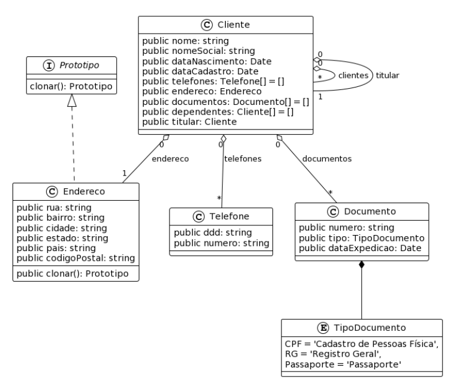

## Atividade I

Empresa criada: Ocean Solutions

Fundador, Dev e Engenheiro de Software: André Salerno

- Sistema: Atlantis
- Fase: concepção (MVP)
- Perfil: generalista
- Objetivo: nesse primeiro módulo faremos o cadastramento de clientes e seus dependentes (convidados)
- Quem é o cliente?

Uma pessoa que irá usufruir dos serviços do parque, clube ou hotel.

Obs.: todo convidado(dependente) tem um responsável, os dados de endereço e telefones do dependente devem ser iguais aos dados do responsável

## Diagrama de classe




## Rodar projeto

```powershell
git clone https://github.com/andresalerno/TPIII-atvi-atlantis.git
```

```powershell
# atvi folder
npm run dev
```